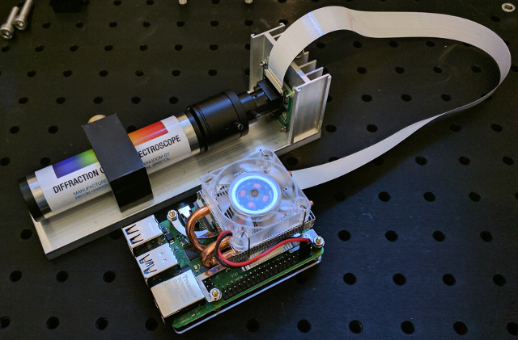
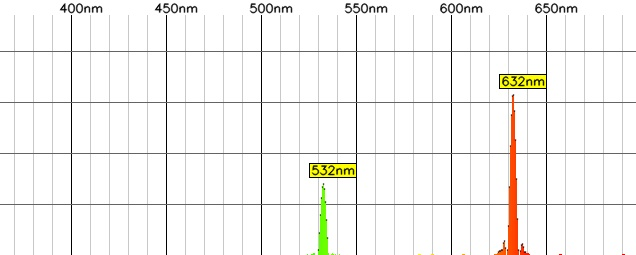
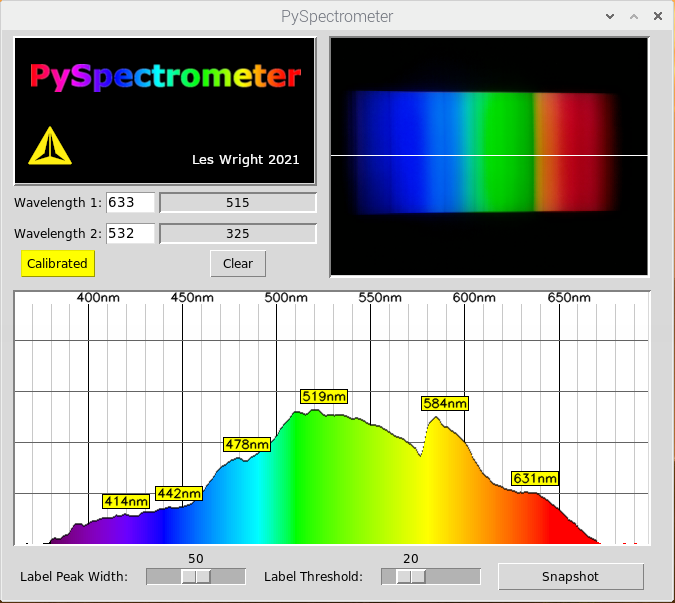
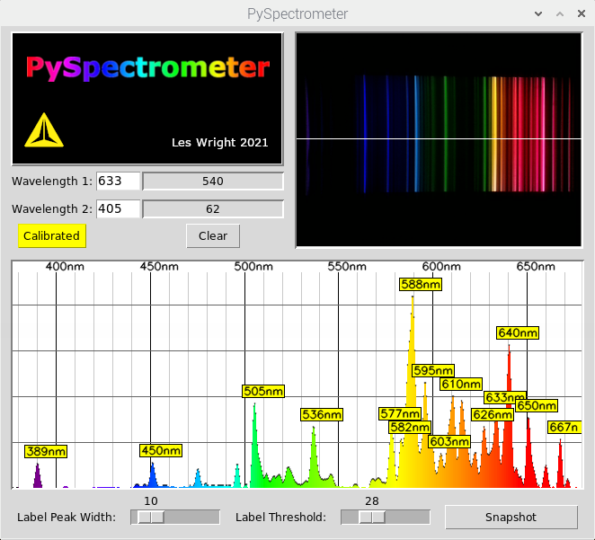

# PySpectrometer 2021-03-05

***Raspberry Pi Spectrometer***

The PySpectrometer is a Python implementation of an optical spectrometer. The motivation beind this project was to build a tool that could measure the wavelength of home-made Dye Lasers and perform some fluorescence spectroscopy.

The hardware is simple and widely avilable and so should be easily to duplicate without critical alignment or difficult construction. The hard work was developing the software.

Resolution/accuracy seems to be +/- a couple of nm or so, pretty reasonable for the price of the hardware, especially when you consider the price of commercial components such as the Hamamatsu C12880MA breakout boards which run north of 300 bucks, and has a resolution of 15nm. Of course, this is much larger, but not enormous!

Visit my Youtube Channel at: https://www.youtube.com/leslaboratory

This program and assiciated information is free for non-commercial use, but if you have gotten value from these kinds of projects and think they are worth something, please consider donating: https://paypal.me/leslaboratory?locale.x=en_GB

***Hardware***

The hardware consists of: 

***A commercial Diffraction grating Spectroscope***
https://www.patonhawksley.com/product-page/benchtop-spectroscope

***A Raspberry Pi Camera (with an M12 Thread)***
https://thepihut.com/products/raspberry-pi-camera-adjustable-focus-5mp

***A CCTV Lens with Zoom (M12 Thread)*** 
(Search eBay for F1.6 zoom lens)

Everything is assembled on an aluminium base (note the Camera is not cooled, the heatsink was a conveniently sized piece of aluminium.

***Installation***

Developed and tested on: 2021-01-11-raspios-buster-armhf-full.img for anything else your milage may vary!

Rasberry pi 4 and PiCamera Recommended. 

(Note the software uses the Linux Video Driver, not the Picam Python module. As a consequence it is camera agnotstic, so it will work with some webcams on probably any Linux box (Tested on Debian with a random webcam)) 

First attach the Picam, and enable it with raspi-config

Install the dependencies:

sudo apt-get install python3-opencv

sudo apt-get install python-dev libatlas-base-dev

pip3 install scipy

pip3 install peakutils

Run the program with: python3 pyspectrometer-v1.py

To calibrate, shine 2 Lasers of known wavelength (He-Ne, Argon or DPSS recommended! (Diode Lasers can have wavelengths that can be +/- several nm!)) at a piece of card in front of the spectrometer.

Click the two peaks on the graph, and in each of the boxes enter the corresponding wavelength. Then hit 'Calibrate'. In this example I have Calibrated with 532nm (DPSS) and 633nm He-Ne. The Scale and lablels will then adjust to match your values.

For good accuracy make sure your wavelengths are quite far apart, ideally one at the red end and one at the blue end

Alternatively, you may use a Fluorescent tube (or any other gas discharge tube) in front of the Spectrometer, you will have to research the wavelengths of the emission lines (Mercury for Fluorescent tubes, Neon, Argon, Xenon for other types) That will be an excercise for you!

***Other settings***

"Label Peak width" and "Label threshold" set the width of a peak to label, and the level to consider it a peak respectively. The Defaults are fine, but if you find the graph too cluttered, you can play with these values.

Snapshot, takes a snapshot of the graph section like this:

***Example Spectra***

Here is an example of the spectra of a fluorescent bulb. The peaks at 405,435,545,650 are Mercury, Europium (one of the lamp phosphors) is visible at ~610nm.

Measuring the wavelength of a cheap red laser pointer (661nm)

Measuring the wavelength of a cheap violet Laser pointer, note the strong fluorescence from the paper! Paper is optically brightened with a fluorescent dyes, most likely Coumarin.

The spectra of Daylight (pointed out of the window at a blue sky)

The spectra of of a Helium-Neon Discharge

***TODO***

Done! Add a slider to control smoothing. See pyspectrometer-v2.py

