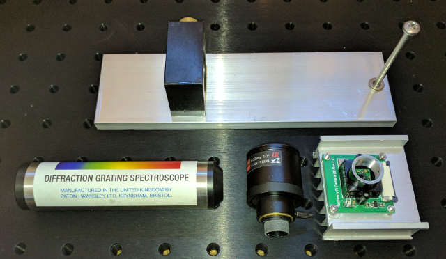

# PySpectrometer

***Raspberry Pi Spectrometer***

The PySpectrometer is a Python implementation of an optical spectrometer. The motivation beind this project was to build a tool that could measure the wavelength of home-made Dye Lasers and perform some fluorescence spectroscopy.

The hardware is simple and widely avilable and so should be easily to duplicate without critical alignment or difficult construction. The hard work was developing the software.

Visit my Youtube Channel at: https://www.youtube.com/leslaboratory

This program and assiciated information is free for non-commercial use, but if you have gotten value from these kinds of projects and think they are worth something, please consider donating: https://paypal.me/leslaboratory?locale.x=en_GB

***Hardware***

The harware consists of: 

A commercial Diffraction grating Spectroscope

A Raspberry Pi Camera (with an M12 Thread)

A CCTV Lens with Zoom (M12 Thread)

Everything is assembled on an aluminium base (note the Camera is not cooled, the heatsink was a conveniently sized piece of aluminium.

