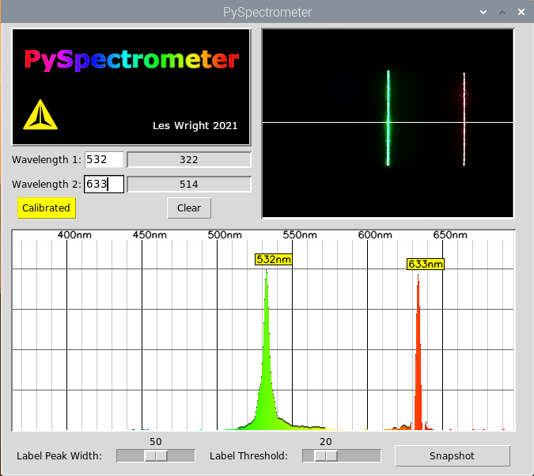
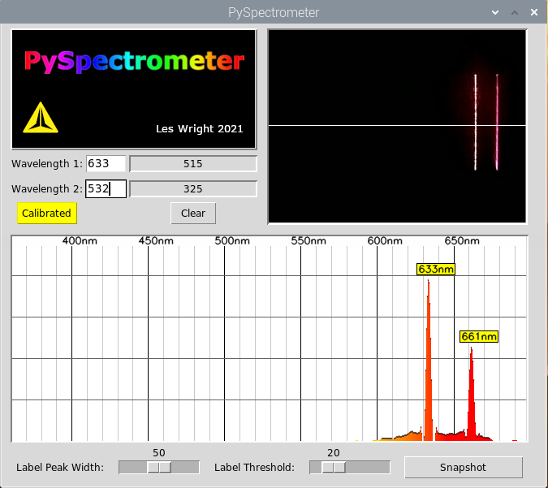
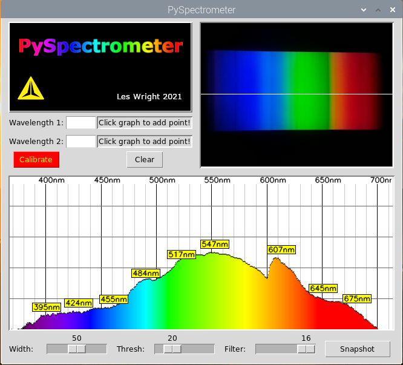
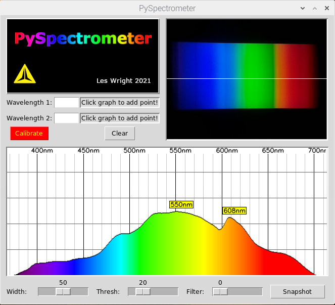
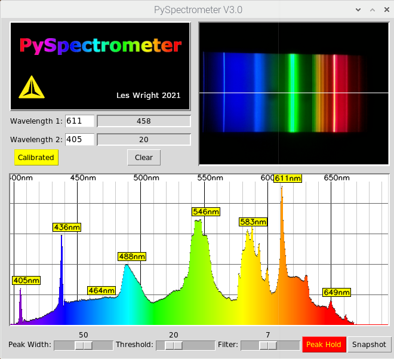
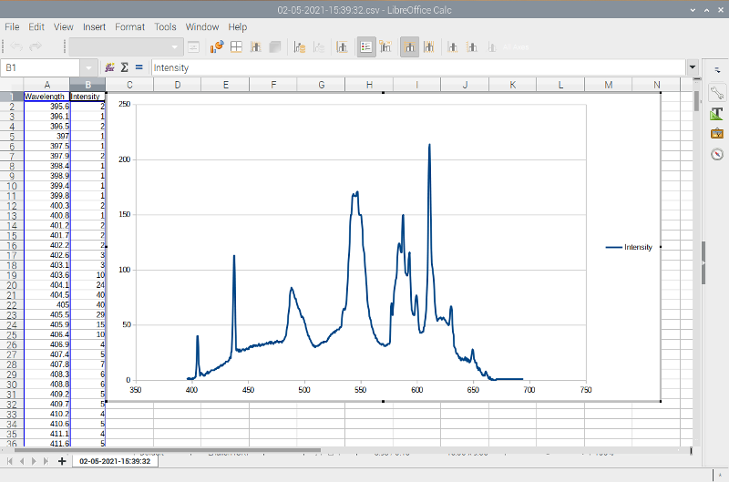
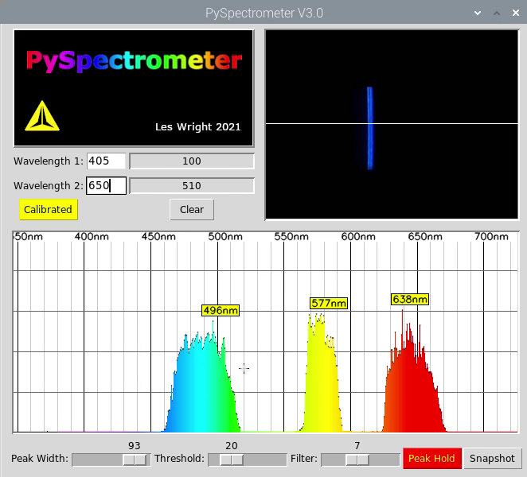

# PySpectrometer 2021-03-05

***V3 is now released that can export CSV, and has a peak hold feature! Scroll to bottom for changes!***

***This program, hardware design, and associated information is Open Source (see Licence), but if you have gotten value from these kinds of projects and think they are worth something, please consider donating:*** https://paypal.me/leslaboratory?locale.x=en_GB

***Raspberry Pi Spectrometer***

The PySpectrometer is a Python (OpenCV and Tkinter) implementation of an optical spectrometer. The motivation beind this project was to build a tool that could measure the wavelength of home-made Dye Lasers and perform some fluorescence spectroscopy. Most importantly at a cost that is in reach of everyone!

The hardware is simple and widely avilable and so should be easily to duplicate without critical alignment or difficult construction. The hard work was developing the software.

Resolution/accuracy seems to be +/- a couple of nm or so, pretty reasonable for the price of the hardware, especially when you consider the price of commercial components such as the Hamamatsu C12880MA breakout boards which run north of 300 bucks, and has a resolution of 15nm. Of course, this build is physically much larger, but not enormous!

Visit my Youtube Channel at: https://www.youtube.com/leslaboratory

Videos of this project are here:

***Hardware***

The hardware consists of: 

***A commercial Diffraction grating Spectroscope***
https://www.patonhawksley.com/product-page/benchtop-spectroscope

***A Raspberry Pi Camera (with an M12 Thread)***
https://thepihut.com/products/raspberry-pi-camera-adjustable-focus-5mp

***A CCTV Lens with Zoom (M12 Thread)*** 
(Search eBay for F1.6 zoom lens)

Everything is assembled on an aluminium base (note the Camera is not cooled, the heatsink was a conveniently sized piece of aluminium.)

For the MINIATURE version the hardware is:

A commercial Diffraction grating Pocket Spectroscope: https://www.patonhawksley.com/product-page/pocket-spectroscope

A Raspberry Pi Camera (with an M12 Thread) https://thepihut.com/products/raspberry-pi-camera-adjustable-focus-5mp

M12x0.5 F2.0 Fixed 12mm Focal length Lens: https://www.ebay.co.uk/itm/114551239930

***Installation***

Developed and tested on: 2021-01-11-raspios-buster-armhf-full.img for anything else your milage may vary!

Rasberry pi 4 and PiCamera Recommended. 

(Note the software uses the Linux Video Driver, not the Picam Python module. As a consequence it will work with some webcams on probably any Linux box (Tested on Debian with a random webcam)) 

First attach the Picam, and enable it with raspi-config

Install the dependencies:

sudo apt-get install python3-opencv

sudo apt-get install python-dev libatlas-base-dev

pip3 install scipy

pip3 install peakutils

Run the program with: python3 pyspectrometer-v1.py

To calibrate, shine 2 Lasers of known wavelength (He-Ne, Argon or DPSS recommended! (Diode Lasers can have wavelengths that can be +/- several nm!)) at a piece of card in front of the spectrometer.

Click the two peaks on the graph, and in each of the boxes enter the corresponding wavelength. Then hit 'Calibrate'. In this example I have Calibrated with 532nm (DPSS) and 633nm He-Ne. The Scale and lablels will then adjust to match your values.

For good accuracy make sure your wavelengths are quite far apart, ideally one at the red end and one at the blue end

Alternatively, you may use a Fluorescent tube (or any other gas discharge tube) in front of the Spectrometer, you will have to research the wavelengths of the emission lines (Mercury for Fluorescent tubes, Neon, Argon, Xenon for other types) That will be an excercise for you!

***Other settings***

"Label Peak width" and "Label threshold" set the width of a peak to label, and the level to consider it a peak respectively. The Defaults are fine, but if you find the graph too cluttered, you can play with these values.

Snapshot, takes a snapshot of the graph section like this:

***Example Spectra***

Here is an example of the spectrum of a fluorescent bulb. The peaks at 405,435,545,650 are Mercury, Europium (one of the lamp phosphors) is visible at ~610nm.

Measuring the wavelength of a cheap red laser pointer (661nm)

Measuring the wavelength of a cheap violet Laser pointer, note the strong fluorescence from the paper! Paper is optically brightened with a fluorescent dyes, most likely Coumarin.

The spectrum of Daylight (pointed out of the window at a blue sky)

The spectrum of of a Helium-Neon Discharge.

Minimum smoothing applied:

Maximum smoothing applied:

***Version 3***

Version 3 has a Peak hold feature to detect transient events, such as a Laser pulse, or a Camera Flash!

Pressing the snapshot button also dumps data to a CSV file. This is far more accurate data than the graph window, and can be imported into OpenOffice on the Pi.

***Note: Filenames have colons in them. Unix like OS's e.g. Linux have no issue, but you will find that you have to rename these if you want to import to Windows!***

Tuning curves obtined from a home-made pulsed Dye Laser.
From Left to right: Coumarin-1,Rhodamine 6G, Rhodmine B.

***TODO***
Add in a 3 wavelength Calibration functionality to counteract any nonlinearity caused by misalignment of the camera and 'scope. Non Linearity can be solved by rotating the camera on its axis, but it would be nice to just fire and forget.

